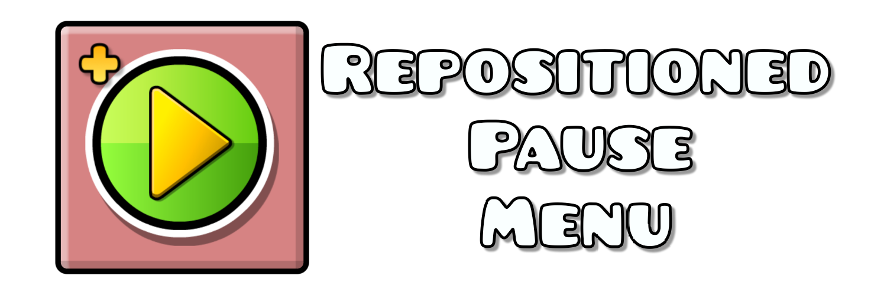
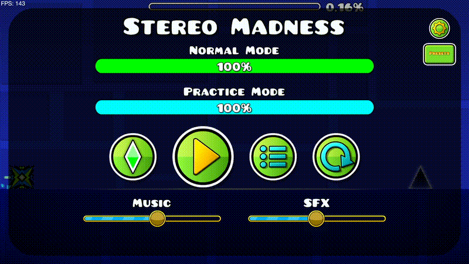

  

<h3 align="center">This mod repositions the buttons of the pause menu</h3>

<h1 align="center">Preview</h1>

  

<h1 align="center">Credits</h1>

<h2 align="center">
  <a href="https://github.com/Bluescratch7545">Bluescratch</a>
</h2>

<h4 align="center">
  Made Repositioned Pause Menu itself coding and etc
</h4>

<h2 align="center">
  <a href="https://github.com/arthursimao">Arthur</a>
</h2>

<h4 align="center">
  Made the icon + readme for Repositioned Pause Menu
</h4>
